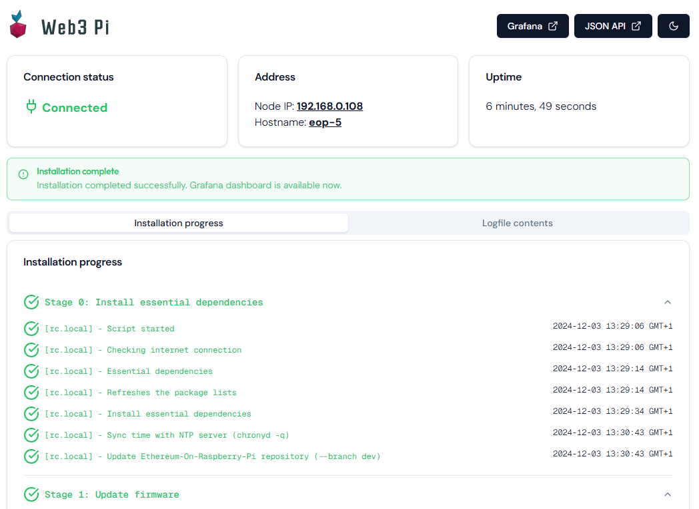

# Installation status page



## Development

Make sure you have [bun](https://bun.sh/) installed before running the following commands:

Install dependencies:

```bash
bun install
```

Start the development server:

```bash
bun run dev
```

This will start the api server and the vite development server (providing hot reloading).

## Build

To build the application, run:

```bash
bun run build
```

This will first build the web application to static html js and css files, and then bundle them into a single executable. This will result in a file called `app` containing the static files, server code and javascript runtime.

## Run in production

To start the application run:

```bash
PORT=80 LOG_PATH=/path/to/status.txt JLOG_PATH=/path/to/installation.jlog ./app
```

If `PORT` is not specified it will default to `3000`

If `LOG_PATH` is not specified it will default to `/var/log/web3pi.log`

If `JLOG_PATH` is not specified it will default to `/opt/web3pi/status.jlog`
